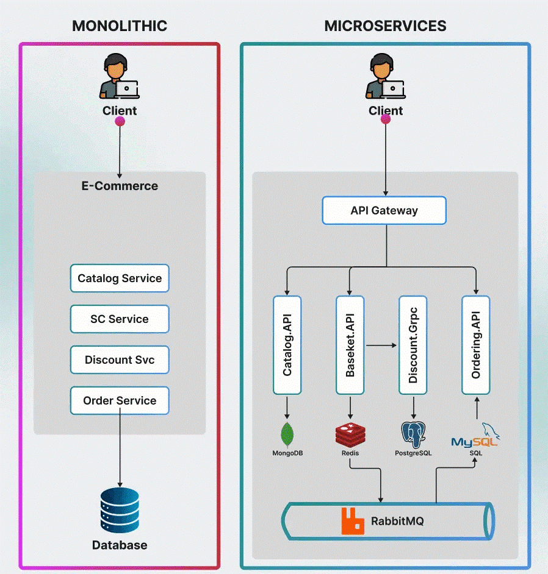

# My Project

Kafka Elastic Search Microservice

This repository is part of the Node.js Microservice with Kafka and Elastic Search

1. I have written the test case for the project using Jest.
    Jest is a JavaScript testing framework designed to ensure correctness of any JavaScript codebase
    Use npm test to check the test cases.
    npm test

